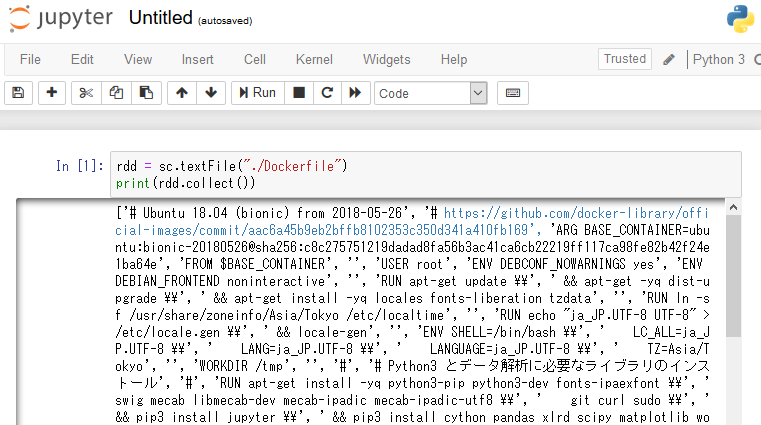

# Spark をインストールして jupyter から触る

## 参考文献
- [Pythonで動かしてみるSpark入門](https://qiita.com/miyamotok0105/items/bf3638607ef6cb95f01b)
- [Spark API チートシート](https://qiita.com/sotetsuk/items/6e4e2953799078fd6027#parallelize)
- [本家サイト](http://spark.apache.org/docs/2.2.0/api/python/index.html)

## 変更箇所
```
#
# Spark のインストール
#
RUN apt-get install -y openjdk-8-jdk
RUN curl -O http://ftp.riken.jp/net/apache/spark/spark-2.4.0/spark-2.4.0-bin-hadoop2.6.tgz
RUN ls -la
RUN tar zxvf spark-2.4.0-bin-hadoop2.6.tgz
RUN mv spark-2.4.0-bin-hadoop2.6 /usr/local/
RUN ln -s /usr/local/spark-2.4.0-bin-hadoop2.6 /usr/local/spark

RUN cp /usr/local/spark/conf/log4j.properties.template /usr/local/spark/conf/log4j.properties
RUN sed -i -e 's/log4j.rootCategory=INFO, console/log4j.rootCategory=WARN, console/' /usr/local/spark/conf/log4j.properties

ENV SPARK_HOME /usr/local/spark
ENV PATH $PATH:$SPARK_HOME/bin
ENV PYSPARK_PYTHON /usr/bin/python3
ENV PYSPARK_DRIVER_PYTHON jupyter
ENV PYSPARK_DRIVER_PYTHON_OPTS notebook

#
# Jupyter の実行
#
EXPOSE 8888
CMD ["/usr/local/spark/bin/pyspark"]
```
完成品は[こちら](./Dockerfile)。

## 動作確認
import しなくても SparkContext が読み込まれている。


