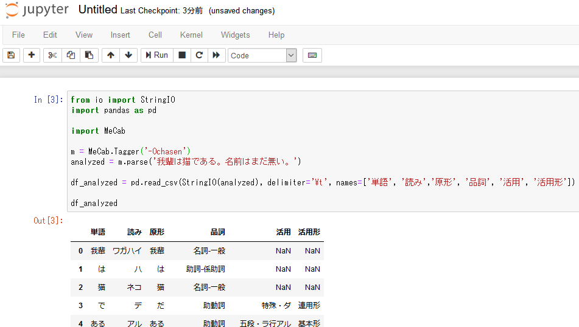
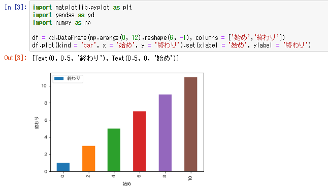

# データサイエンスに利用するライブラリをインストールする

## もくじ
<!-- TOC depthFrom:1 depthTo:6 withLinks:1 orderedList:0 -->

- [データサイエンスに利用するライブラリをインストールする](#データサイエンスに利用するライブラリをインストールする)
	- [もくじ](#もくじ)
	- [はじめに](#はじめに)
	- [注意](#注意)
	- [Dockerfile の改変](#dockerfile-改変)
	- [起動と停止](#起動停止)

<!-- /TOC -->

## はじめに
ここでは[Jupyter を構築する](../setup_jupyter_env/readme.md)で作成した Dockerfile を改変して
データサイエンスでよく利用される次のライブラリやソフトをインストールしていきます。

- 処理をなるべく早くするために Cython
- データプリパレーションで有用な pandas, scipy
- 機械学習フレームワークの tensorflow, scikit-learn, gensim
- web スクレイピングで使う requests, aiohttp, scrapelib, etc
- 形態素解析器 MeCab, mecab-ipadic-neologd

## 注意
ここでは形態素解析器のインストールを行います。Windwos 10 Home など docker toolbox を
利用する環境では、docker を動かす VM のディスクやメモリが足りなくなってきます。
次のコマンドをコマンドプロンプトで実行し、VM を作り直してください ( VirtualBox への操作になるので、
docer terminal ではなくコマンドプロンプトで実行します )。
なお、VirtualBox のポートフォワードを再度設定する必要もあります。

```
# default を削除
docker-machine rm default
# 改めて default を作成 ( disk : 60GB, mem : 8GB )
docker-machine create -d virtualbox --virtualbox-memory "8192" --virtualbox-disk-size 60000 default
```

## Dockerfile の改変
前回 %USERPROFILE%\Documents\docker\datascience に作成した Dockerfile を
テキストエディタで開き、26 行目あたりを次のとおり変更します。
大きく変更します。ざっくりとやってください。

- 変更前

```
RUN apt-get install -yq  python3-pip python3-dev \
 && pip3 install jupyter \
 && jupyter notebook --generate-config
```

- 変更後

```
WORKDIR /tmp

RUN apt-get install -yq python3-pip python3-dev fonts-ipaexfont \
    mecab libmecab-dev mecab-ipadic mecab-ipadic-utf8 \
    git curl sudo \
 && pip3 install jupyter \
 && pip3 install cython pandas scipy matplotlib scikit-learn tensorflow gensim \
 && pip3 install requests aiohttp scrapelib lxml beautifulsoup4 feedparser \
 && pip3 install mecab-python3 \
 && jupyter notebook --generate-config

RUN git clone --depth 1 https://github.com/neologd/mecab-ipadic-neologd.git \
 && yes yes | /tmp/mecab-ipadic-neologd/bin/install-mecab-ipadic-neologd -n -a \
 && mecab -d /usr/local/lib/mecab/dic/mecab-ipadic-neologd/

RUN sed -i -e 's/^#font.family.*/&\nfont.family : IPAexGothic/' /usr/local/lib/python3.6/dist-packages/matplotlib/mpl-data/matplotlibrc

RUN echo "c.IPKernelApp.matplotlib = 'inline'" >> /root/.jupyter/jupyter_notebook_config.py
```

完成品は[こちら](./Dockerfile)

## 起動と停止
前回同様、楽しんでください。

- Mecab の動作確認

- Matplotlib で日本語の確認

