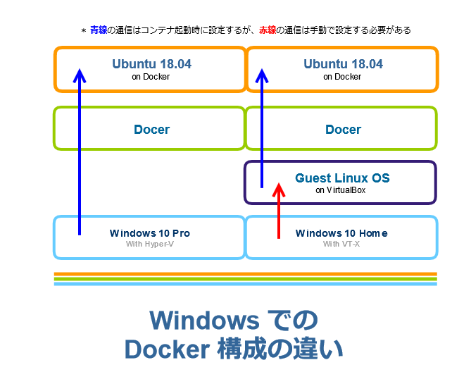
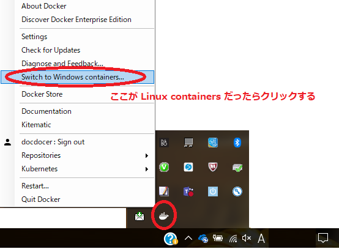
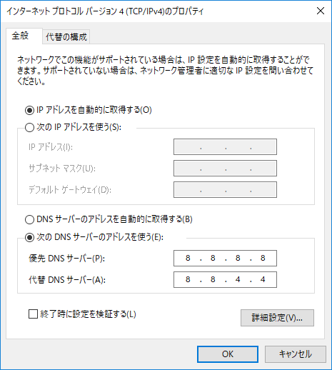
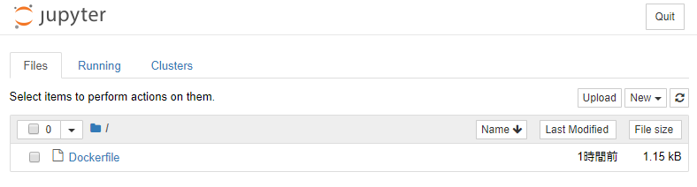

# Jupyter を構築する

## もくじ
<!-- TOC depthFrom:1 depthTo:6 withLinks:1 orderedList:0 -->

- [Jupyter を構築する](#jupyter-を構築する)
	- [もくじ](#もくじ)
	- [はじめに](#はじめに)
	- [docker のインストール](#docker-のインストール)
		- [Windows 10 Pro の場合](#windows-10-pro-の場合)
		- [Windows 10 Home とそれ以下](#windows-10-home-とそれ以下)
		- [両者の違い](#両者の違い)
			- [Tips : Docker CE で Linux container を利用する場合](#tips-docker-ce-linux-container-を利用する場合)
			- [Tips : VirtualBox のポートフォワードを設定する](#tips-virtualbox-のポートフォワードを設定する)
			- [Tips : VirtualBox が Windows Update 後に起動できなくなった場合](#tips-virtualbox-が-windows-update-後に起動できなくなった場合)
	- [docker イメージの作成](#docker-イメージの作成)
		- [ファイル共有用のディレクトリを作成](#ファイル共有用のディレクトリを作成)
		- [Dockerfile を作成する](#dockerfile-を作成する)
		- [docker image を作成する](#docker-image-を作成する)
	- [docker container の起動と停止](#docker-container-の起動と停止)
		- [起動](#起動)
		- [ホスト OS から Jupyter にアクセス](#ホスト-os-から-jupyter-にアクセス)
		- [停止](#停止)

<!-- /TOC -->

## はじめに
ここでは Windows 環境に docker をインストールし、ubuntu イメージに Python3 が使える Jupyter notebook を構築することを目的とします。

## docker のインストール
基本的に、Web 上に有志によるドキュメントが数多くあるので、詳細はここでは書きません。

### Windows 10 Pro の場合
Windows 10 Pro の場合、Docker CE をインストールするだけですが、事前に Hyper-V の有効化を実施しておく必要があります ( 要再起動 ) 。
また、初回起動時に「docker に必要な機能がインストールされていない」というアラートにより再起動やログオフが必要になることがあります。

1. [Windows 10 での Hyper-V の有効化 | Microsoft Docs](https://docs.microsoft.com/ja-jp/virtualization/hyper-v-on-windows/quick-start/enable-hyper-v)
2. [docker for WindowsをWindows10 Proにインストール](https://qiita.com/anikundesu/items/7ecf20b7e8a60f8439a8)

### Windows 10 Home とそれ以下
Hyper-V を設定することができないので、必要なソフトがパッケージングされている docker tools を利用します。
ただし、事前に Virtualization Technology (VT-X) を有効にする必要があります ( 要 BIOS 設定変更 )。

1. Bios の設定はメーカやモデルによって異なるので割愛
2. [Windows10マシンにdocker Toolbox を入れて個人用の開発環境を作る](https://qiita.com/osuo/items/99a2b7413ce75f8217be)

### 両者の違い
Windows 10 Pro の場合は Windows に直接 docker をインストールしますが、Windows 10 Home の場合は一度 VM を構築しその上で docker が動作します。
なので、docker コマンドを実行するとき次の様な構成の違いが出てきます。

 - Windows 10 Pro : windows → コマンドプロンプト → docker コマンド
 - Windows 10 Home : windows → docekr terminal ( VirtualBox ) → docker コマンド



#### Tips : Docker CE で Linux container を利用する場合
タスクトレイの docker アイコンを右クリックし「Switch to Linux containers」をクリックする必要があります。



#### Tips : VirtualBox のポートフォワードを設定する
docker Toolbox は内部で VirtualBox 上のゲスト OS ( イメージ名 : default ) が動作しているので、これと通信できるよう[VirtualBox上のゲストOSにホストOSからNATでアクセスする]( https://www.karakaram.com/virtualbox-port-fowarding)を参考に設定を変更する必要があります。
ここでは、Jupyter notebook をインターフェイスとするため、ホスト OS 127.0.0.0:8888 からゲスト OS :8888 にアクセスできるようにしてください。

#### Tips : VirtualBox が Windows Update 後に起動できなくなった場合
2018/11/11 現在、最新の docker toolbox をインストールすると VirtualBox v5.2.8 がバンドルされていますが、ネットワークアダプタを作成することができず起動できません。その場合、最新の VirtualBox v5.2.22 をダウンロードし、上書きでインストールしてください。

## docker イメージの作成
[Dockerで基本的なData Science環境(Jupyter, Python, R, Julia, 定番ライブラリ)を構築する。](https://qiita.com/y4m3/items/c2703d4e131e05084b7b) を参考に Jupyter 公式が配布している
Dockerfile 利用してもよいのですが、次の不都合があるので自作します。

1. 言語環境が en_US.UTF8 → ja_JP.UTF8 にしたい
2. python のパッケージマネージャが Anaconda → pip にしたい
( [condaとpip：混ぜるな危険](http://onoz000.hatenablog.com/entry/2018/02/11/142347) )
3. 好きなライブラリの組み合わせで環境を構築したい

### ファイル共有用のディレクトリを作成
任意の場所にディレクトリを作成する

- Windows 10 Pro の場合コマンドプロンプトで実行
```
mkdir %USERPROFILE%\Documents\docker\datascience
```

- Windows 10 Home ( docker Toolbox ) の場合 docer terminal 上で下記を実行
```
mkdir -p ~/Documents/docker/datascience
```

### Dockerfile を作成する
%USERPROFILE%\Documents\docker\datascience に Dockerfile という名前のファイルを作成し、次の内容を記述する

```
# Ubuntu 18.04 (bionic) from 2018-05-26
# https://github.com/docker-library/official-images/commit/aac6a45b9eb2bffb8102353c350d341a410fb169
ARG BASE_CONTAINER=ubuntu:bionic-20180526@sha256:c8c275751219dadad8fa56b3ac41ca6cb22219ff117ca98fe82b42f24e1ba64e
FROM $BASE_CONTAINER


USER root
ENV DEBCONF_NOWARNINGS yes
ENV DEBIAN_FRONTEND noninteractive

RUN apt-get update \
 && apt-get -yq dist-upgrade \
 && apt-get install -yq locales fonts-liberation tzdata

RUN ln -sf /usr/share/zoneinfo/Asia/Tokyo /etc/localtime

RUN echo "ja_JP.UTF-8 UTF-8" > /etc/locale.gen \
 && locale-gen

ENV SHELL=/bin/bash \
    LC_ALL=ja_JP.UTF-8 \
    LANG=ja_JP.UTF-8 \
    LANGUAGE=ja_JP.UTF-8 \
    TZ=Asia/Tokyo

RUN apt-get install -yq  python3-pip python3-dev \
 && pip3 install jupyter \
 && jupyter notebook --generate-config

RUN sed -i \
    -e "s/^#c.NotebookApp.token = .*/c.NotebookApp.token = ''/" \
    -e "s/^#c.NotebookApp.password = .*/c.NotebookApp.password = ''/" \
    -e "s/^#c.NotebookApp.ip = .*/c.NotebookApp.ip = '0.0.0.0'/" \
    -e "s/^#c.NotebookApp.allow_root = False/c.NotebookApp.allow_root = True/" \
    -e "s/^#c.NotebookApp.open_browser = True/c.NotebookApp.open_browser = False/" \
    -e "s/^#c.NotebookApp.notebook_dir = .*/c.NotebookApp.notebook_dir = '\/root\/work'/" \
    /root/.jupyter/jupyter_notebook_config.py

RUN echo "#!/bin/bash" > /usr/local/bin/start_jupyter.sh
RUN echo "jupyter notebook --NotebookApp.token='' --NotebookApp.password='' --NotebookApp.notebook_dir='/root/work' --ip=0.0.0.0 --allow-root --no-browser" >> /usr/local/bin/start_jupyter.sh
RUN chmod u+x /usr/local/bin/start_jupyter.sh

EXPOSE 8888
CMD ["/usr/local/bin/start_jupyter.sh"]
```

### docker image を作成する
1. Windows 10 Pro の場合
コマンドプロンプトで実行
```
cd %USERPROFILE%\Documents\docker\datascience
docker build -t datascience .
```
2. Windows 10 Home ( docker Toolbox ) の場合
docker terminal 上で下記を実行
```
cd ~/Documents/docker/datascience
docker build -t datascience .
```

### Could not resolve 'security.ubuntu.com'
docker はホスト OS の DNS 設定を基にしてイメージの DNS を設定します。ところが、この方法ではうまく ubuntu のリポジトリサーバを探すことができずに次の様に失敗してしまうことがあります。

```
Err:1 http://security.ubuntu.com/ubuntu artful-security InRelease
  Could not resolve 'security.ubuntu.com'
Err:2 http://us.archive.ubuntu.com/ubuntu artful InRelease
  Could not resolve 'us.archive.ubuntu.com'
Err:3 http://us.archive.ubuntu.com/ubuntu artful-updates InRelease
  Could not resolve 'us.archive.ubuntu.com'
Err:4 http://us.archive.ubuntu.com/ubuntu artful-backports InRelease
  Could not resolve 'us.archive.ubuntu.com'
```

その場合、次の様に DNS を設定してください ( 8.8.8.8, 8.8.4.4 は Google が提供する DNS サーバです ) 。




## docker container の起動と停止
### 起動
Windows 10 Pro の場合は次のコマンドで実行できます ( Windows 10 Home の場合は -v の引数を ~/Documents/docker/datascience:/root/work に置き換えてください )。
上記で作成したディレクトリ %USERPROFILE%\Documents\docker\datascience を docker イメージの /root/work にマウント
```
docker run -itd -p 8888:8888 -v %USERPROFILE%\Documents\docker\datascience:/root/work --user root datascience
```

### ホスト OS から Jupyter にアクセス
ブラウザを起動し、http://localhost:8888 にアクセスします。次のとおり、はじめは先ほど作成した Dockerfile のみ見えている状態になります。
ここで画面右上の「New」ボタンを押すと Python3 や terminal ( Bash ) を書くことができます。



### 停止
1. 起動しているコンテナの ID を取得
```
docker ps -l
CONTAINER ID        IMAGE               COMMAND                   CREATED              STATUS                     PORTS               NAMES
c2393603d270        datascience         "/usr/local/bin/star…"   About a minute ago   Exited (0) 7 seconds ago                       admiring_beaver
```
2. コンテナの ID を指定して停止
```
docker stop c2393603d270
```
